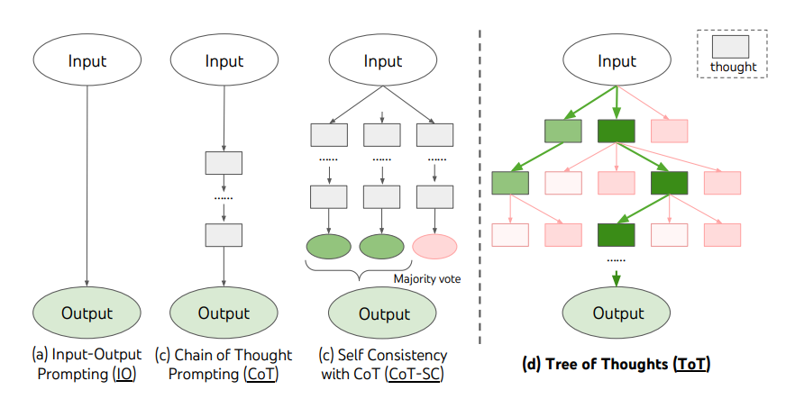

# Tree of Thought Experimentation with Langchain4j

This project explores the implementation of the Tree of Thought (ToT) approach using the Java Langchain4j library - ["Tree of Thoughts: Deliberate Problem Solving with Large Language Models"](https://arxiv.org/abs/2305.10601).



The concept for this project is directly inspired by the aforementioned research paper, which introduces a new framework for language model inference. This framework allows for deliberate decision-making by considering multiple reasoning paths, self-evaluating choices, and performing strategic lookaheads or backtracking when necessary.

Also, this approach could be used for [System 2 thinking](https://thedecisionlab.com/reference-guide/philosophy/system-1-and-system-2-thinking). System 2 Thinking gives the AI more "time" to think and reason about a problem statement.


This simple exploration project doesn't aim at implementing the full Tree of Thought approach, but rather at experimenting with Langchain4j and LM Studio to see how they can be used to implement the Tree of Thought approach. Although not a full implementation, this project will provide a starting point for anyone interested in experimenting with the Tree of Thought approach using Langchain4j and LM Studio.

For further inspiration please watch this video [ChatGPT-4 Prompt Engineering: The Tree of Thoughts Method - WOW!](https://www.youtube.com/watch?v=PFK5g_kxhVM) by [All About AI](https://www.youtube.com/@AllAboutAI)

## About Langchain4j

Langchain4j is a Java library designed to simplify the integration of AI/Large Language Model (LLM) capabilities into Java applications. It provides a unified API for interacting with various LLM providers and embedding stores, making it easier to experiment with different LLMs without the need to rewrite code. For more details on Langchain4j, visit the [official GitHub repository](https://github.com/langchain4j/langchain4j).

## LM Studio

For local development and testing, this project utilizes LM Studio, a platform that allows for the deployment and management of LLMs. LM Studio facilitates the use of LLMs without the need for external API keys when running models locally. Learn more about LM Studio at [LM Studio's website](https://lmstudio.ai/).

## Java Notebooks

This project leverages the power of Java notebooks to create an interactive development environment. Java notebooks allow for the execution of Java code in an interactive manner.

To set up Java notebooks for your own use, follow the comprehensive guide available at [Jupyter Notebooks and Java](https://www.javaadvent.com/2023/12/jupyter-notebooks-and-java.html). This guide covers everything from the basics of Jupyter Notebooks to integrating Java into Jupyter environments, both locally and in the cloud.

**However, you can use the code in any Java IDE by copying the code from the notebook.**

## Quick Start

1. Ensure you have Jupyter Notebooks installed and configured to run Java kernels. The guide linked above provides detailed instructions on how to achieve this.
2. Clone this repository and navigate to the project directory.
3. Start your Jupyter Notebook server and open the `llm_developer.ipynb` notebook.
4. Follow the instructions within the notebook to explore the Tree of Thought approach using Langchain4j and LM Studio.

---


## Deeper experiment explanation

The main AI model, which in our case is GPT-3.5 or GPT-4, will reach out to its tools/agents to perform sub-task like brainstorming or evaluation. The main AI model is acting as a brain and is responsible for thinking and planning.

The agents are separate AI models running in LM Studio. In my particular case, I am using _Google's Gemma 2B Instruct_ published on a local server which is mimicking OpenAI API standards:


Posing this question to the main AI model: _I want you to assume a role of a philosopher. What is the meaning of life?_; the main AI model will reach out to its agents to perform brainstorming and evaluation.

For example, this is a query passes to the local model based, which is acting as a Brainstorming agent, on the original question from the user: 
```
ACT as a professional philosopher and brainstorm on this problem statement: What is the meaning of life? Give different possible solutions that make sense.
```

The local Gemma model responds:
```markdown
**The Meaning of Life: A Philosophical Exploration**

Life, an enigmatic tapestry woven with countless threads of meaning, is a question that has captivated philosophers, thinkers, and individuals for millennia. While the pursuit of material wealth and worldly success may hold allure, it is the pursuit of something more profound that holds true significance.

**Existentialism's Embrace:**
Existentialist philosophers, such as Jean-Paul Sartre, emphasize the absurdity and alienation of existence. Life is devoid of inherent meaning, forcing individuals to actively create their own purpose and significance. Sartre's quote, "I am a human being who is free and capable of choosing," encapsulates this existentialist perspective.

**Humanism's Perspective:**
On the other hand, humanists like Aristotle and Plato believe that life has intrinsic value and meaning. Humans are inherently good and possess an innate desire for knowledge, growth, and self-actualization. For humanists, life's purpose lies in fulfilling these inherent potentialities and contributing to a greater good.

**Spiritual Perspectives:**
Religious traditions offer various perspectives on the meaning of life. In Christianity, salvation is defined by faith and the pursuit of a meaningful relationship with God. In Buddhism, enlightenment is the ultimate goal, characterized by freedom from suffering and liberation from the cycle of rebirth.

**Personal Growth and Transformation:**
Philosophers such as Viktor Frankl and Carl Rogers emphasize the transformative power of life experiences. Through challenges and adversity, individuals can undergo personal growth, self-discovery, and a deeper understanding of themselves and their place in the world.

**Social Connection and Contribution:**
Beyond individual fulfillment, meaningful life also lies in contributing to a community and leaving a lasting impact on others. Acts of kindness, compassion, and social engagement can foster a sense of purpose and belonging.

**Conclusion:**
The meaning of life is an elusive and multifaceted question that transcends mere material pursuits. While existentialism emphasizes the futility of seeking inherent meaning, humanism and spirituality offer perspectives on intrinsic value and transformation. Personal growth, social connection, and a meaningful contribution to society are also important threads in weaving a life imbued with purpose and significance. Ultimately, the search for life's meaning is an ongoing journey that requires reflection, introspection, and a willingness to explore different avenues of knowledge and experience.
```

Based on this response, the main AI model (GPT-4) then proceeds to evaluate the possible solutions reaching out the the Evaluation agent with this message:
```
ACT as a professional philosopher and evaluate this problem Statement: What is the meaning of life? with these solutions: Existentialism's Embrace, Humanism's Perspective, Spiritual Perspectives, Personal Growth and Transformation, Social Connection and Contribution. For each of the proposed solutions, evaluate their potential. Consider their pros and cons, initial effort needed, implementation difficulty, potential risks and how well they solve the problem. Give a score from 1-10 on how good the solution is to each option based on these factors.
```

The evaluation agent reposponds (as can be seen in the LM Studio logs):
```markdown
## Existentialism's Embrace

**Pros:**
* Acknowledges the absurdity and meaninglessness of existence.
* Encourages individuals to explore their own values and purpose in life.
* Promotes authenticity and self-discovery.

**Cons:**
* Can be nihilistic and lead to a lack of direction and purpose.
* May not provide practical guidance for navigating life's challenges.
* Can be isolating for those who feel disconnected from society.

Score: 7/10

## Humanism's Perspective

**Pros:**
* Focuses on human values and experiences, offering a more practical and optimistic outlook.
* Encourages empathy, compassion, and social engagement.
* Provides a framework for personal growth and fulfillment.

**Cons:**
* May overlook the existential question of meaning in a meaningless universe.
* Can be subjective and vary widely depending on individual values and beliefs.
* May lead to a superficial focus on worldly pursuits at the expense of deeper meaning.

Score: 8/10

## Spiritual Perspectives

**Pros:**
* Provides a sense of purpose and connection to something greater than oneself.
* Encourages self-reflection and spiritual growth.
* Can provide solace and comfort in difficult times.

**Cons:**
* May conflict with scientific and rational perspectives.
* Can be challenging to define and verify objectively.
* May lead to the formation of false gods or a distorted sense of reality.

Score: 6/10

## Personal Growth and Transformation

**Pros:**
* Emphasizes self-awareness, self-reflection, and personal responsibility.
* Promotes positive change and self-actualization.
* Provides a framework for overcoming obstacles and achieving personal growth.

**Cons:**
* Can be self-centered and lead to narcissistic behavior.
* May be difficult for individuals with low self-esteem or self-doubt.
* Requires significant effort and self-discipline.

Score: 9/10

## Social Connection and Contribution

**Pros:**
* Promotes empathy, compassion, and understanding of others.
* Encourages participation in society and contributes to its betterment.
* Provides a sense of belonging and purpose.

**Cons:**
* Can be challenging to navigate social dynamics and build meaningful relationships.
* May lead to self-centeredness and neglect of individual needs.
* Can be difficult to balance with personal growth and self-reflection.

Score: 8/10

## Conclusion

The meaning of life is a complex and multifaceted question that has been pondered by philosophers for centuries. Each solution offers a unique perspective on this profound inquiry, with varying levels of depth, practicality, and potential effectiveness. Ultimately, the best solution depends on the individual's values, beliefs, and life experiences.
```

Finaly, the "brain"/main coordinator AI model (GPT-4) will take the evaluation from the Evaluation agent and present it to the user.

```markdown
After evaluating the various philosophical perspectives on the meaning of life, here are the solutions ranked from best to worst, along with justifications for each ranking:

1. **Personal Growth and Transformation (9/10):** This perspective emphasizes self-awareness, self-reflection, and personal responsibility. It promotes positive change, self-actualization, and provides a framework for overcoming obstacles and achieving personal growth. Despite potential drawbacks like the possibility of narcissistic behavior, it offers a practical and fulfilling approach to finding life's meaning through personal development.

2. **Humanism's Perspective (8/10):** Humanism focuses on human values and experiences, offering an optimistic outlook that encourages empathy, compassion, and social engagement. It provides a practical framework for personal fulfillment, though it may overlook deeper existential questions.

3. **Social Connection and Contribution (8/10):** This solution highlights the importance of empathy, compassion, understanding of others, and contributing to society's betterment. It fosters a sense of belonging and purpose, balancing individual needs with societal engagement, despite potential challenges in navigating social dynamics.

4. **Existentialism's Embrace (7/10):** Existentialism acknowledges the absurdity of existence while encouraging individuals to create their own purpose. It promotes authenticity and self-discovery, though it may lead to nihilism and a lack of practical guidance for life's challenges.

5. **Spiritual Perspectives (6/10):** Offering a sense of purpose and connection to something greater, spiritual perspectives encourage self-reflection and growth. However, they may conflict with scientific views and can be challenging to define objectively, leading to a lower ranking.

Each perspective offers valuable insights into the meaning of life, with the best approaches emphasizing personal growth, human values, and social contribution. The choice of perspective may vary based on individual beliefs and experiences, highlighting the subjective nature of this profound question.
```

## Conclusion
Using powerful frameworks like Langchain4j we create a web or a swarm of agents and provide them to the main model as tools or functions it can utilize for expansive thinking.

The agent models themselves don't have to be as powerful as the main coordinator model, thus potentially saving resoureces.

This can bring the capabilities of [System 2 thinking](https://thedecisionlab.com/reference-guide/philosophy/system-1-and-system-2-thinking) directly to AIs.


